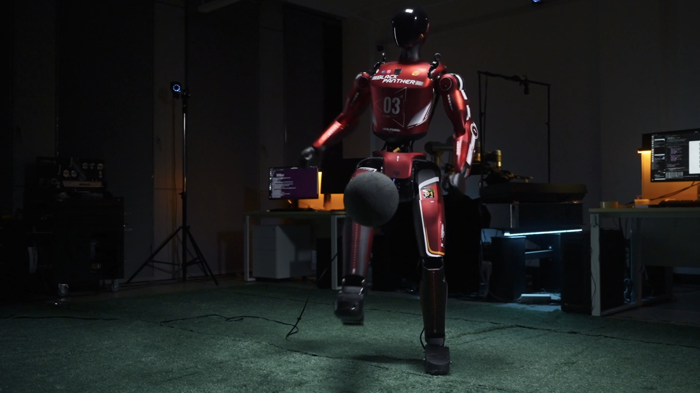
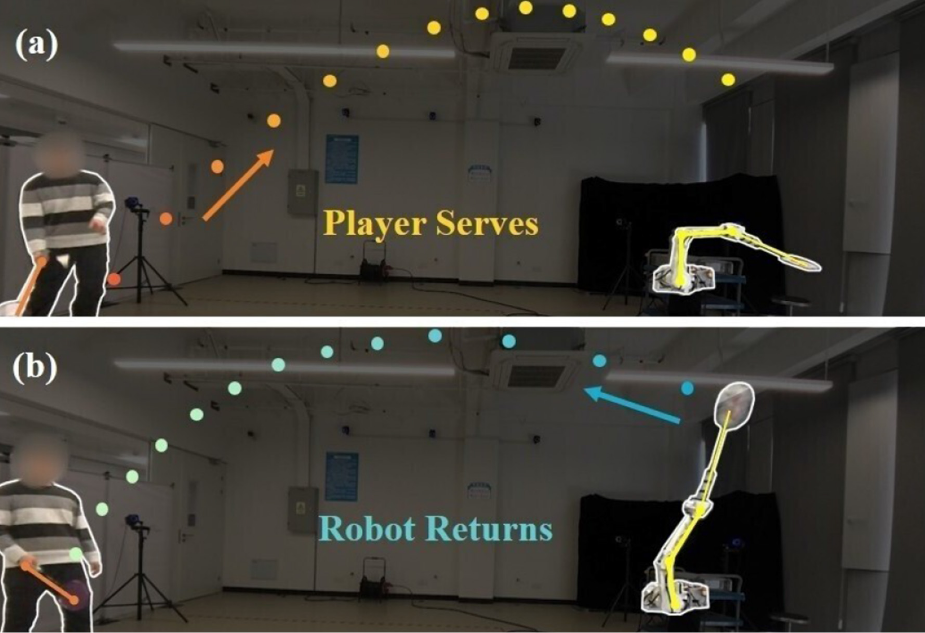
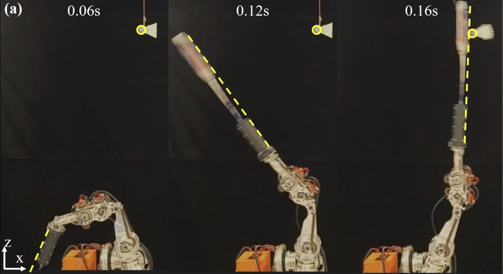

  

    <aside class="sidebar-stack" aria-label="Profile and homepage navigation">
      <section class="sidebar-profile" aria-label="Basic information">
        
        
Yanyan Yuan

        

          <a href="mailto:yuanyanyan98@163.com">
            
              <svg viewBox="0 0 24 24" fill="none" stroke="currentColor" stroke-width="2" stroke-linecap="round" stroke-linejoin="round">
                <rect x="3" y="5" width="18" height="14" rx="2"></rect>
                <path d="m3 7 9 6 9-6"></path>
              </svg>
            
            Email
          </a>
          <a href="https://github.com/YanYuan98">
            
              <svg viewBox="0 0 24 24" fill="currentColor">
                <path d="M12 2a10 10 0 0 0-3.16 19.49c.5.09.68-.22.68-.48v-1.7c-2.78.61-3.37-1.18-3.37-1.18a2.65 2.65 0 0 0-1.11-1.46c-.91-.62.07-.61.07-.61a2.1 2.1 0 0 1 1.53 1.03 2.13 2.13 0 0 0 2.91.83 2.14 2.14 0 0 1 .64-1.34c-2.22-.25-4.56-1.11-4.56-4.95a3.87 3.87 0 0 1 1.03-2.69 3.6 3.6 0 0 1 .1-2.65s.84-.27 2.75 1.03a9.46 9.46 0 0 1 5 0c1.91-1.3 2.75-1.03 2.75-1.03.37.84.41 1.8.1 2.65a3.86 3.86 0 0 1 1.03 2.69c0 3.85-2.34 4.69-4.57 4.94a2.39 2.39 0 0 1 .68 1.85v2.75c0 .27.18.58.69.48A10 10 0 0 0 12 2Z"></path>
              </svg>
            
            GitHub
          </a>
          <a href="https://www.zhihu.com/people/yuan-yan-yan-47">
            知
            Zhihu
          </a>
        

      </section>

      <nav class="side-nav" aria-label="Homepage sections">
        
Contents

        <a href="#about">About</a>
        <a href="#news">News</a>
        <a href="#projects">Projects</a>
        <a href="#Research">Research</a>
      </nav>
    </aside>

    <main class="homepage-main">
      <section class="section-card" id="about">
        

          

            <h1 class="profile-name">Yanyan Yuan (袁炎炎)</h1>
            

              I am Yanyan Yuan. I received my Ph.D. degree in 2025 and B.Eng. degree in 2020 from the School of Aeronautics and Astronautics, Zhejiang University.
            

            

              My research focuses on humanoid robot motion control, general motion tracking, motion generation, behavior foundation models and humanoid-object Interaction. I aim to develop embodiment-aware control methods for robust, agile, and task-adaptive whole-body motion in real-world.
            

            

              I have also worked on the design and control of robotic manipulators and five-finger dexterous hands, with broader interests in connecting robot embodiment, motion generation, and real-world task execution.
            

            

              Humanoid Robot
              Motion Tracking
              Humanoid-Object Interaction
              Behavior Foundation Model
              Robotic Arm
              dexterous robotic hand
            

            

              <a href="mailto:yuanyanyan98@163.com">
                
                  <svg viewBox="0 0 24 24" fill="none" stroke="currentColor" stroke-width="2" stroke-linecap="round" stroke-linejoin="round">
                    <rect x="3" y="5" width="18" height="14" rx="2"></rect>
                    <path d="m3 7 9 6 9-6"></path>
                  </svg>
                
                Email
              </a>
              <a href="https://github.com/YanYuan98">
                
                  <svg viewBox="0 0 24 24" fill="currentColor">
                    <path d="M12 2a10 10 0 0 0-3.16 19.49c.5.09.68-.22.68-.48v-1.7c-2.78.61-3.37-1.18-3.37-1.18a2.65 2.65 0 0 0-1.11-1.46c-.91-.62.07-.61.07-.61a2.1 2.1 0 0 1 1.53 1.03 2.13 2.13 0 0 0 2.91.83 2.14 2.14 0 0 1 .64-1.34c-2.22-.25-4.56-1.11-4.56-4.95a3.87 3.87 0 0 1 1.03-2.69 3.6 3.6 0 0 1 .1-2.65s.84-.27 2.75 1.03a9.46 9.46 0 0 1 5 0c1.91-1.3 2.75-1.03 2.75-1.03.37.84.41 1.8.1 2.65a3.86 3.86 0 0 1 1.03 2.69c0 3.85-2.34 4.69-4.57 4.94a2.39 2.39 0 0 1 .68 1.85v2.75c0 .27.18.58.69.48A10 10 0 0 0 12 2Z"></path>
                  </svg>
                
                GitHub
              </a>
              <a href="https://www.zhihu.com/people/yuan-yan-yan-47">
                知
                Zhihu
              </a>
            

          

          
        

      </section>

      <section class="section-card" id="news">
        <h2>News</h2>
        <ul class="news-list">
          <li>
            2026-06
            Released a demonstration of a soccer-ball juggling task on the Bolt humanoid robot, showcasing dynamic whole-body coordination and balance control.
          </li>
        </ul>
      </section>

      <section class="section-card" id="projects">
        <h2>Projects</h2>
        

          <article class="publication-item">
            
            

              <h3 class="paper-title">Humanoid Robot Bolt Juggle Soccer Ball</h3>
              
<strong>Yanyan Yuan</strong>, Mirrorme Technology Co., Ltd.

              

                <a href="https://www.zhihu.com/pin/2048524691153876702">Project Page</a>
              

            

          </article>
        

      </section>

      <section class="section-card" id="Research">
        <h2>Research</h2>
        

          <article class="publication-item">
            
            

              <h3 class="paper-title">Imitation-Relaxation Reinforcement Learning for Sparse Badminton Strikes via Dynamic Trajectory Generation</h3>
              
<strong>Yanyan Yuan</strong>, Yucheng Tao, Shaowen Cheng, Yanhong Liang, Yongbin Jin, Hongtao Wang

              
<strong>Front. Neurorobot.</strong>,
              Volume 19, 02 September 2025
              

              

                <a href="DTG-IRRL-For-Badminton/">Project Page</a>
                <a href="https://github.com/Stylite-Y/DTG_IRRL_for_Badminton">Code</a>
              

            

          </article>

          <article class="publication-item">
            

              
            

            

              <h3 class="paper-title">Optimal Design of High-Dynamic Robotic Arm Based on Angular Momentum Maximum</h3>
              
<strong>Yanyan Yuan</strong>, Xianwei Liu, Lei Jiang, Yongbin Jin, Hongtao Wang

              
<strong>IEEE Robotics and Automation Letters</strong>, Volume 10, Issue 4, April 2025

            

          </article>
        

      </section>
    </main>
  

